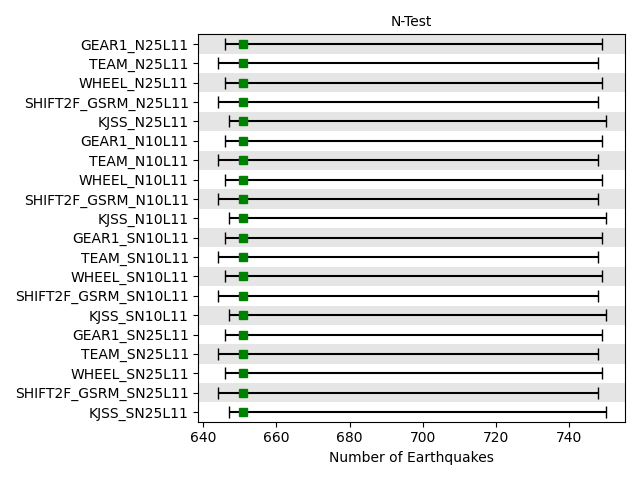
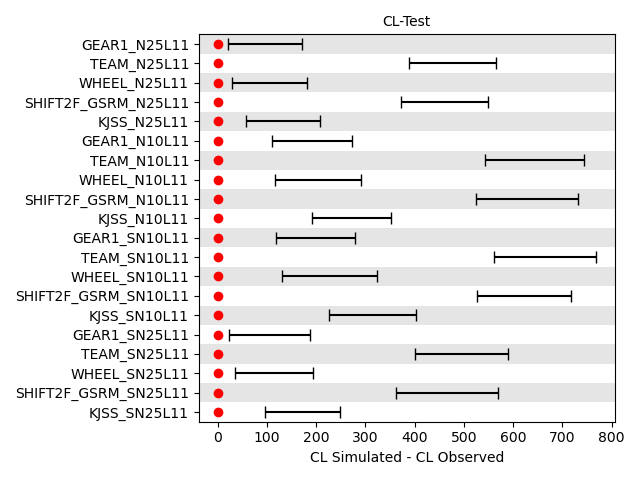
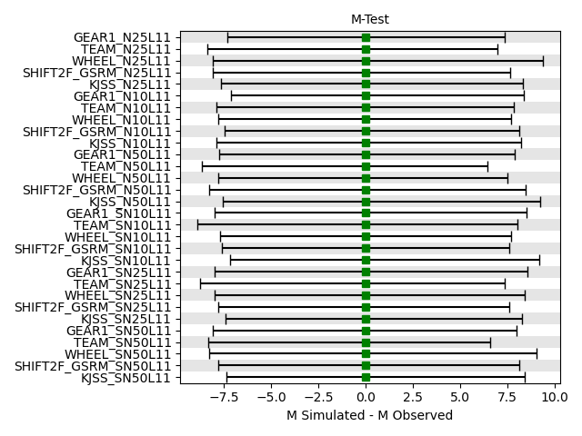
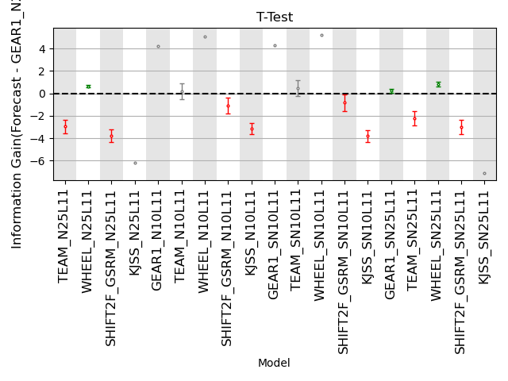

Global Earthquake Forecast Experiment (GEFE)
============================================

Contents
========

* [Overview](#overview)
	* [Objectives](#objectives)
* [Forecast Experiment](#forecast-experiment)
	* [Authoritative Data](#authoritative-data)
	* [Competing Forecast Models](#competing-forecast-models)
	* [Quadtree Forecasts](#quadtree-forecasts)
	* [Evaluations](#evaluations)

# Overview

On 1 January 2006, the Working Group of the Regional Earthquake Likelihood Models (RELM; Field 2007; Schorlemmer et al. 
2007; Schorlemmer and Gerstenberger, 2007) launched an earthquake forecasting experiment to evaluate earthquake 
predictability in California.The RELM experiment sparked a series of subsequent regional forecasting experiments in a 
variety of tectonic settings and the establishment of four testing centers on four different continents (Zechar et al. 
2010; Michael and Werner, 2018; Schorlemmer et al. 2018).

In addition to the regional experiments, CSEP promotes earthquake predictability research at a global scale (Eberhard et
 al. 2012; Taroni et al. 2014; Michael and Werner, 2018; Schorlemmer et al. 2018).Compared to regional approaches, 
global seismicity models offer great testability due to the relatively frequent occurrence of large events worldwide 
(Bayona et al. 2020). In particular, global M5.8+ earthquake forecasting models can be reliably ranked after only one 
year of prospective testing (Bird et al. 2015). In this regard, Eberhard et al. (2012) took a major step toward 
conducting a global forecast experiment by prospectively testing three earthquake forecasting models for the western 
Pacific region. Based on two years of testing, the authors found that a smoothed seismicity model performs the best, and
 provided useful recommendations for future global experiments. Also based on two years of independent observations, 
Strader et al. (2018) determined that the global hybrid GEAR1 model developed by Bird et al. (2015) significantly 
outperformed both of its individual model components, providing preliminary evidence that the combination of smoothed 
seismicity data and interseismic strain rates is suitable for global earthquake forecasting.

## Objectives

- Describe the predictive skills of posited hypothesis about seismogenesis with earthquakes of M5.95+ independent observations around the globe.
- Identify the methods and geophysical datasets that lead to the highest information gains in global earthquake forecasting.
- Test earthquake forecast models on different grid settings.
- Use Quadtree based grid to represent and evaluate earthquake forecasts.

# Forecast Experiment

## Authoritative Data

- The authoritative earthquake catalog is the full Global CMT catalog (Ekström et al. 2012).
- We confine the hypocentral depths of earthquakes in training and testing datasets to a maximum of 70km

## Competing Forecast Models

TIme independent global seismicity models are provided.The earthquake forecasts are rate-based, i.e. forecast are 
provided as earthquake rates for each longitude/latitute/magnitude bins with bin size of 0.1. All forecasting models 
compute earthquake rates within unique depth bin, i.e. [0 km, 70km]  
Following forecast models are competing in this experiment
- GEAR1 (Bird et al. 2015)
- WHEEL (Bayona et al. 2021)
- TEAM (Bayona et al. 2021)
- KJSS (Kagan and Jackson (2011))
- SHIFT_GSRM2F (Bird & Kreemer (2015))

## Quadtree Forecasts

 Quadtree info 
## Evaluations

### N-test
  

### CL-Test
  

### M-test
  

### S-test
  

### T-test
  
