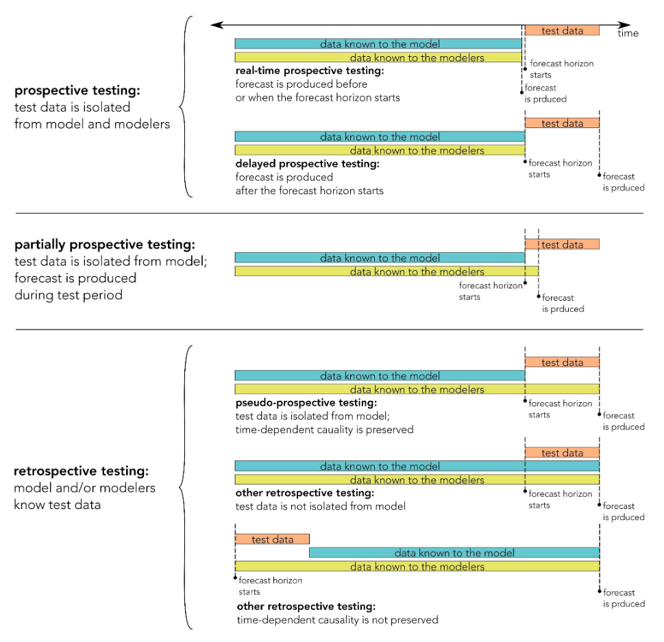
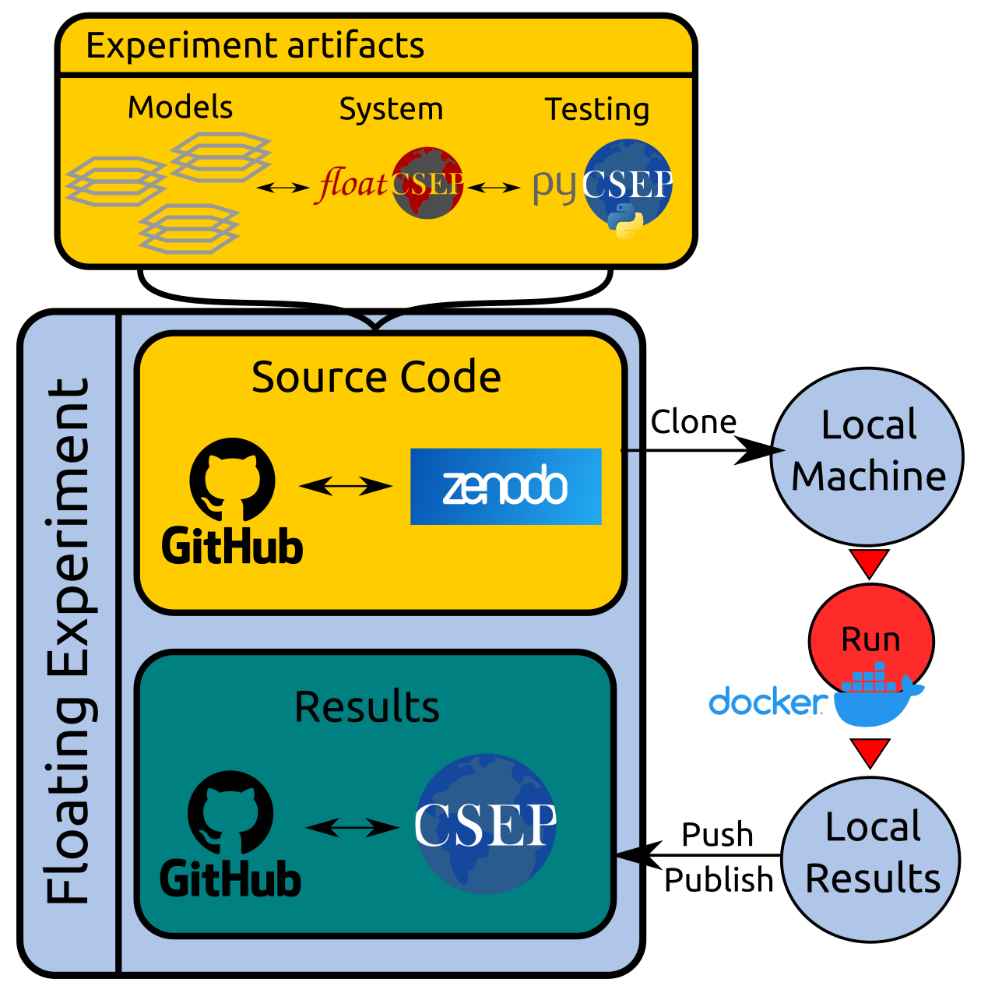

Concepts
========

Forecasting Models
-----------------------------

An earthquake **Forecasting Model** is a representation of our understanding of seismicity, consisting of a collection of hypotheses, assumptions, data and methods. It is capable of generating **Forecasts**, i.e., `a probabilistic statement about the future occurrence of seismicity, which may include information about its magnitude and spatial location` (see the `Core Concepts <https://docs.cseptesting.org/getting_started/core_concepts.html>`_ in the **pyCSEP** documentation). For now, we support earthquake forecasts expressed as:

    * **Gridded Forecasts**: Expected occurrence rate in a spatial-magnitude-temporal discretization.
    * **Catalog Forecasts**: Families of synthetic earthquake catalogs.

From a computational perspective, a **Model** can be conceptualized as a **black-box system**, which receives an **input** (e.g. catalog, time window, target magnitude) to produce an **output** (a forecast). A model may consist of a single or a collection forecast (e.g., no input required and the output is given directly), or a forecast-generating source-code, which could require a training catalog to be calibrated.

Forecasting Experiments
-----------------------

A **Forecasting Experiment** is defined here as the complete scientific process that encodes the questions, hypotheses to be addressed by **Forecasting Models**, and the **Evaluation** of such hypotheses and their results.
The purpose of an experiment is to ultimately lead to scientific and methodological improvements in our forecasting capabilities.

In **Prospective Experiments**, the parameters of the experiment (including forecast generation, data sets, and evaluation metrics) must be defined with zero degrees of freedom before any evaluations begin. Prospective experiments provide the most objective view of a model's forecasting skill, by removing any unconscious (or conscious) bias of the modelers during forecast production. On the other hand, **Retrospective** experiments or **Pseudo-Prospective** experiments, where the testing data is known to the modeler, are also important during model development and should be carried out as standard scientific praxis.

   Different experiment classes depending on the data temporality and its availability to the modeler. Figure from Mizrahi et al., (2024).

Examples of past prospective experiments are:

.. list-table::
   :header-rows: 1
   :widths: 20 80

   * - Region
     - References
   * - California
     - * `Schorlemmer, D., & Gerstenberger, M. (2007). RELM testing center. Seismological Research Letters, 78(1), 30-36. <https://doi.org/10.1785/gssrl.78.1.30>`_
       * `Schorlemmer, D., et al. (2010). First results of the regional earthquake likelihood models experiment. Seismogenesis and Earthquake Forecasting: The Frank Evison Volume II, 5-22. <https://doi.org/10.1007/978-3-0346-0500-7_2>`_
       * `Strader, A., et al. (2017). Prospective and retrospective evaluation of five-year earthquake forecast models for California. Geophysical Journal International, 211-1, 239–251. <https://doi.org/10.1093/gji/ggx268>`_
   * - Japan
     - * `Nanjo, K., et al. (2011). Overview of the first earthquake forecast testing experiment in Japan, Earth Planets Space, 63 (3), 159–169 <doi:10.5047/eps.2010.10.003>`_
       * `Tsuruoka, H., et al., (2012). CSEP Testing Center and the first results of the earthquake forecast testing experiment in Japan. Earth, planets and space, 64, 661-671. <https://doi.org/10.5047/eps.2012.06.007>`_

   * - New Zealand
     - * `Gerstenberger, M., & Rhoades, D. (2010). New Zealand earthquake forecast testing centre. Seismogenesis and Earthquake Forecasting: The Frank Evison Volume II, 23-38. <https://doi.org/10.1007/978-3-0346-0500-7_3>`_
       * `Rhoades, D., et al. (2018). Highlights from the first ten years of the New Zealand earthquake forecast testing center. Seismological Research Letters, 89(4), 1229-1237. <https://doi.org/10.1785/0220180032>`_
   * - Italy
     - * `Schorlemmer, D., et al. (2010). Setting up an earthquake forecast experiment in Italy. Annals of Geophysics. <https://doi.org/10.4401/ag-4844>`_
       * `Taroni, M., et al. (2018). Prospective CSEP evaluation of 1‐day, 3‐month, and 5‐yr earthquake forecasts for Italy. Seismological Research Letters, 89(4), 1251-1261. <https://doi.org/10.1785/0220180031>`_
       * `Iturrieta, P., et al. (2024). Evaluation of a Decade-Long Prospective Earthquake Forecasting Experiment in Italy. Seismological Research Letters. <https://doi.org/10.1785/0220230247>`_

Floating Experiments
--------------------

They are a new conceptual framework for modern prospective experiments, whose operation rely on version control systems (i.e. ``git``), open-data repositories ((e.g. `Zenodo <https://zenodo.org>`_) and the containerization of computational environments (e.g., `Docker <https://docker.com>`_), making experiments reproducible, re-usable and shareable during the time scale of the evaluations. **Floating Experiments** are computational reproducibility packages (e.g., `World Bank <https://reproducibility.worldbank.org/>`_) expanded to a dynamic implementation, as new earthquake data becomes available in time and new testing results can be continuously released.

   The forecasting experiment is stored along with the system (**floatCSEP**) and testing routines (**pyCSEP**). It can be cloned to a local machine and run to create results, by using a containerized environment. Results can then be published back into the same repositories, tagging a version/release for each update.

**floatCSEP** assists scientists and institutions in the deployment of forecasting experiments, by standardizing and curating the artifacts and methods required to continuously run and/or reproduce an experiment, without it being coupled to a fixed physical infrastructure.

References
----------

    * Mizrahi, L., Dallo, I., van der Elst, N. J., Christophersen, A., Spassiani, I., Werner, M. J., et al. (2024). Developing, testing, and communicating earthquake forecasts: Current practices and future directions. Reviews of Geophysics, 62, e2023RG000823. https://doi.org/10.1029/2023RG000823
    * Iturrieta, P., Savran, W. H., Khawaja, M. A. M., Bayona, J., Maechling, P. J., Silva, F., et al. (2023). Modernizing earthquake forecasting experiments: The CSEP floating experiments. In AGU Fall Meeting Abstracts (Vol. 2023).
    * Savran, W. H., Bayona, J. A., Iturrieta, P., Asim, K. M., Bao, H., et al. (2022). pyCSEP: a Python toolkit for earthquake forecast developers. Seismological Society of America, 93(5), 2858-2870. https://doi.org/10.1785/0220220033
    * Krafczyk, M. S., Shi, A., Bhaskar, A., Marinov, D., Stodden, V., (2021). Learning from reproducing computational results: Introducing three principles and the Reproduction Package. Philosophical Transactions of the Royal Society A: Mathematical, Physical and Engineering Sciences 379, 20200069. https://doi.org/10.1098/rsta.2020.0069.

